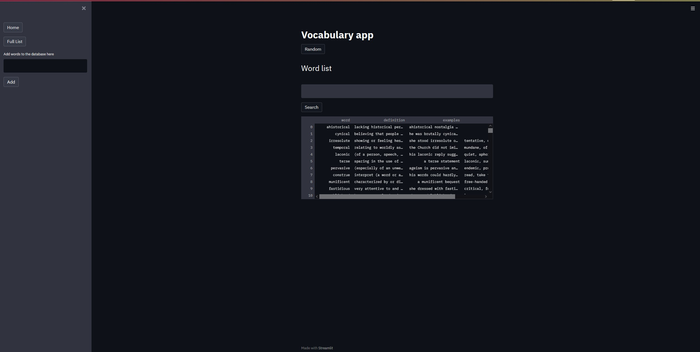

# Vocab Journal - A Vocabulary Revision app 
https://sam-vocab.herokuapp.com/

 - Streamlit
 - MongoDB
 - Heroku

<!--  |  -->
<table><tr>
<td> 
  

    
     
  
 
</td>
</tr></table>

A simple, personal vocabulary web app made using Streamlit and MongoDB to add and store new words and get their meaning using Free Dictionary API
Intended for GRE preparation, where one can keep inserting new words they learn or come across. Can be used to get the meaning of the words, example usage and synonyms for revision later. Deployed using Heroku.

Repo is directly used to deploy on heroku, MongoDB connection string was added as a Heroku private Config variable.
User integration allowing multiple users to be added.
